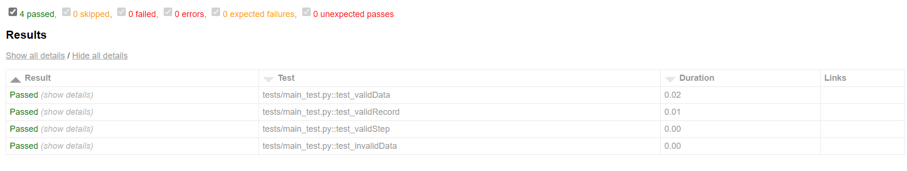
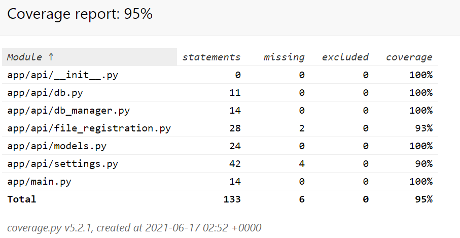
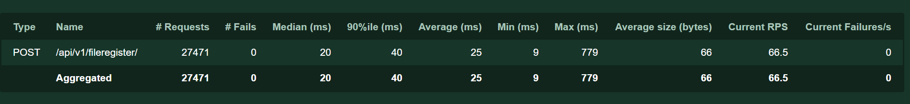

# File Registration Microservice

>FileRegister MS takes in input from FileMonitor MS and updates the data into file log table and step log table

### Input Expected Schema 


```console
{
  "filename"    : string,
  "source_ip"   : string,
  "file_size"   : int,
  "bucket_name" : string,
  "event_name"  : string,
  "event_ts"    : datetime,
  "fp_id"       : int
}
```

API return 422 error if input schema is not expected as above

## Local Deploy

Use docker-compose or Dockerfile to run the service.Docker-compose also comprises of the postgres service

Run the below command to start the service

```console
docker-compose -f .\docker-compose.test.yml up --remove-orphans --exit-code-from fileregister ; docker-compose -f .\docker-compose.test.yml down --rmi local
```

## Running Unit Tests

Pytest is used to run the unit test.Docker-compose is used to run the pytest.

>Pytests generates html files containing the results of the unit tests , along with the code coverage. These are stored in the .testreports folder in root directory of the project.Location can be changed in the docker-compose.test.yml file

Run below command to start the tests

```console
docker-compose -f .\docker-compose.test.yml up --remove-orphans --exit-code-from fileregistertest ; docker-compose -f .\docker-compose.test.yml down --rmi local
```

### Unit test report



### Code Coverage report




## Load testing 

Locust is used to peform the load test on the api

command to run load test

```console

locust -f ./loadtest/locustfile.py

```




